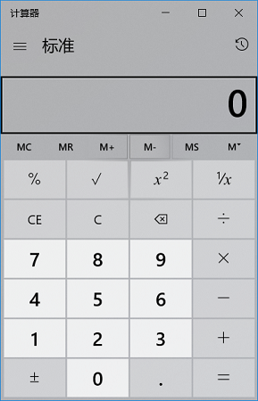
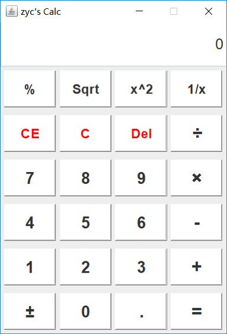
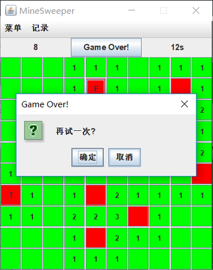
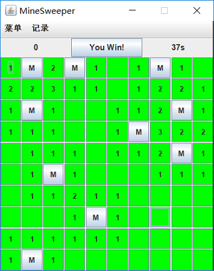
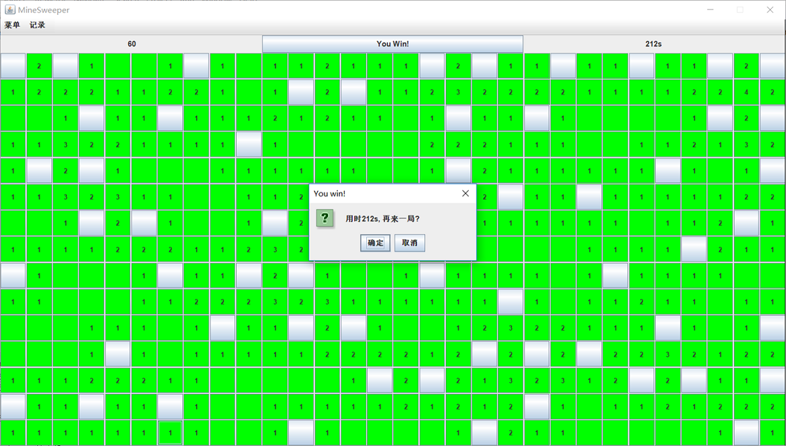

# Minesweeper
My Java project

这是这学期Java课Eliza老师布置的Java作业，我选择的项目是一个简单计算器+一个无聊的扫雷游戏。

## 计算器
计算器项目模仿的是win10上的Calc应用，只能进行简单的两个操作数的计算。

  

## 扫雷
扫雷游戏实现了随机布雷、开始游戏、游戏计时、成绩记录以及自定义难度等功能，玩法与经典的Windows XP扫雷完全一致。

     
  

